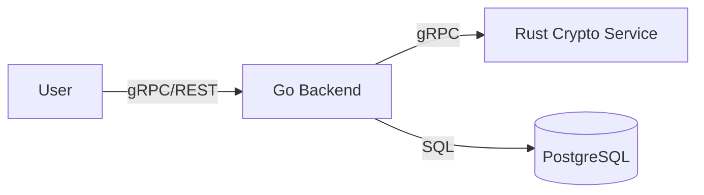

# ShrimPG

[](https://opensource.org/licenses/MIT)
[](https://golang.org)
[](https://www.rust-lang.org)

ShrimPG is a high-performance secrets management system designed with a strong focus on security, modularity, and horizontal scalability.

## 🏛 Architecture Overview
The project is built on microservices architecture principles, decoupling business logic between a high-performance Go backend and a memory-safe Rust cryptographic module.



🛠 Tech Stack

    Core: Go (Golang)

    Security Module: Rust

    Communication: gRPC / Protocol Buffers

    Database: PostgreSQL 16

    Infrastructure: Docker & Docker Compose

🚀 Getting Started
Prerequisites

    Docker & Docker Compose

Installation

Clone the repository:
```Bash
git clone [https://github.com/Krev3tka/ShrimPG.git](https://github.com/Krev3tka/ShrimPG.git)
cd ShrimPG
```

Start the infrastructure:
```Bash
docker-compose up -d
```

📝 Roadmap

    [ ] Finalize gRPC contracts (.proto files)

    [ ] Implement AES-256 encryption in Rust module

    [ ] CI/CD pipeline setup (GitHub Actions)

📄 License

Distributed under the MIT License. See LICENSE for more information.

Built with passion by Krev3tka
